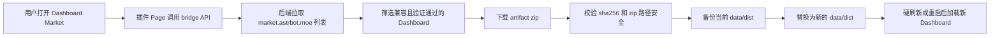

<p align="center">
  
</p>

<p align="center">
  = 4.24.2" />
  
  
  
</p>

---

# AstrBot Dashboard Market

AstrBot Dashboard Market 是一个用于更换 AstrBot 主控制台的插件。它会在插件页中提供一个可浏览、可预览、可安装的 Dashboard 市场，让用户把 AstrBot WebUI 切换成社区发布的自定义 Dashboard，并保留当前 Dashboard 的备份与恢复入口。

安装 Dashboard 后，AstrBot 主 WebUI 会使用新的界面包；插件页面继续作为市场、状态检查和备份恢复面板使用。

> [!IMPORTANT]
> 本插件会写入 AstrBot 数据目录下的 `data/dist`，这是 AstrBot 官方 WebUI 的用户自定义 Dashboard 目录。安装前会自动备份当前 `data/dist`，恢复入口在插件内的「安装管理」面板中。

## 📑 快速导航

- [效果预览](#-效果预览)
- [功能特性](#-功能特性)
- [安装与使用](#-安装与使用)
- [配置项](#-配置项)
- [工作机制](#-工作机制)
- [备份与恢复](#-备份与恢复)
- [常见问题](#-常见问题)

---

## ✨ 效果预览

安装后你会获得一个独立的 Dashboard 市场入口：

| 场景 | 用户体验 |
| --- | --- |
| 浏览 Dashboard | 在插件页中查看所有兼容当前 AstrBot 版本的 Dashboard |
| 查看详情 | 看到封面、截图、版本、作者、兼容范围、验证状态和包校验信息 |
| 安装 Dashboard | 点击安装后自动下载发布包、校验 sha256、备份旧界面并替换主 WebUI |
| 切换界面 | 硬刷新浏览器后进入新的 AstrBot Dashboard 体验 |
| 回到旧界面 | 通过备份列表恢复历史 Dashboard |

这个插件适合想要调整 AstrBot 控制台视觉风格、信息布局、操作入口和日常管理体验的用户。

---

## ✨ 功能特性

- **Dashboard 市场浏览**：直接在 AstrBot 插件页查看已发布的自定义 Dashboard。
- **真实界面预览**：支持封面和截图轮播，安装前先看清楚界面风格。
- **兼容版本筛选**：只展示适配当前 AstrBot 版本且验证通过的 Dashboard。
- **一键安装**：下载市场发布包，校验文件哈希，写入 AstrBot 的 `data/dist`。
- **自动备份**：安装前打包当前 `data/dist`，保留可恢复版本。
- **恢复历史版本**：在安装管理面板中选择备份，一键恢复旧 Dashboard。
- **状态提示清晰**：显示当前使用状态、已安装版本、运行路径和重启需求。
- **安全解包策略**：拒绝路径穿越、绝对路径、Windows drive path、缺失 `index.html` 的发布包。

---

## 🚀 安装与使用

### 1. 安装插件

通过 AstrBot 插件市场安装，或把本仓库放入 AstrBot 插件目录：

```text
AstrBot/
└─ data/
   └─ plugins/
      └─ astrbot_plugin_dashboard_market/
```

本插件要求：

```text
AstrBot >= 4.24.2
```

依赖会随插件安装流程处理。手动安装时可在插件目录执行：

```bash
pip install -r requirements.txt
```

### 2. 打开 Dashboard 市场

进入 AstrBot WebUI：

```text
插件管理 -> Dashboard Market -> Dashboard 市场
```

页面会加载来自 `https://market.astrbot.moe` 的 Dashboard 列表。

### 3. 安装一个 Dashboard

在市场中打开任意 Dashboard 详情页，点击「安装」。

安装成功后：

- 页面会提示安装结果
- 当前 Dashboard 会被备份
- 新 Dashboard 会写入 `data/dist`
- 浏览器硬刷新后加载新主界面

状态显示「重启后生效」时，重启 AstrBot 后再打开 WebUI。

### 4. 管理备份

点击市场页中的安装管理入口，可以查看：

- 当前安装的 Dashboard
- 当前 `data/dist` 版本
- AstrBot 版本
- 运行路径
- 历史备份列表

选择任意备份并点击「恢复」，即可切回对应版本。

---

## ⚙️ 配置项

| 配置项 | 默认值 | 作用 |
| --- | --- | --- |
| `market_base_url` | `https://market.astrbot.moe` | Dashboard 市场地址 |
| `request_timeout_sec` | `30` | 拉取市场列表和下载发布包的超时时间 |
| `max_backups` | `5` | 最多保留的 Dashboard 备份数量 |
| `max_artifact_mb` | `256` | 单个 Dashboard 发布包大小上限 |

配置入口：

```text
插件管理 -> Dashboard Market -> 插件配置
```

---

## 🏗️ 工作机制

AstrBot 主 WebUI 启动时会优先读取用户自定义目录 `data/dist`。本插件利用这个官方目录完成 Dashboard 切换。



安装写入位置：

```text
AstrBot/data/dist/
```

插件数据位置：

```text
AstrBot/data/plugin_data/astrbot_plugin_dashboard_market/
├─ backups/              # Dashboard 备份 zip 与元数据
├─ work/                 # 临时下载与解包目录
├─ registry_cache.json   # 市场列表缓存
└─ install_state.json    # 当前安装状态
```

---

## 🛡️ 备份与恢复

每次安装新 Dashboard 前，插件会把当前 `data/dist` 打包到备份目录。备份元数据会记录：

- 备份 ID
- 创建时间
- 原 Dashboard 版本
- 备份包路径
- 备份包大小

恢复流程会把备份 zip 解包并重新写回 `data/dist`。恢复失败时，插件会尝试回滚到操作前的目录状态。

---

## 📂 插件目录结构

```text
astrbot_plugin_dashboard_market/
├─ .astrbot-plugin/
│  └─ i18n/                         # 插件名称、页面标题和配置文案
├─ dashboard_market/
│  ├─ installer.py                  # 下载包校验、备份、替换、恢复
│  ├─ market.py                     # 市场 API、兼容性过滤、下载逻辑
│  └─ service.py                    # 安装服务编排
├─ frontend/
│  └─ src/                          # Dashboard Market 插件页源码
├─ pages/
│  └─ market/                       # 已构建的插件 Page 静态产物
├─ tests/                           # 安装器和服务测试
├─ main.py                          # AstrBot 插件入口与 Web API 注册
├─ metadata.yaml                    # 插件元数据
├─ _conf_schema.json                # 插件配置 schema
└─ requirements.txt                 # Python 依赖
```

---

## ❓ 常见问题

### 安装后为什么要硬刷新？

浏览器可能仍持有旧 WebUI 的静态资源缓存。硬刷新会重新请求 `index.html` 和构建资源。

### 状态显示「重启后生效」是什么意思？

当前 AstrBot 运行时的 Dashboard 静态目录还指向旧路径。重启后 AstrBot 会重新选择 `data/dist` 作为主 WebUI 目录。

### 如何回到 AstrBot 自带 Dashboard？

在安装管理面板恢复安装前备份。也可以清理 `data/dist` 后重启 AstrBot，让 AstrBot 使用内置 Dashboard。

### 市场里为什么只显示一部分 Dashboard？

插件会按当前 AstrBot 版本、验证状态和 artifact 信息过滤列表。通过验证且兼容当前版本的 Dashboard 会进入安装列表。

### 安装失败后当前 Dashboard 会受影响吗？

安装流程在临时目录中完成下载、解包和校验。替换失败时会回滚旧 `data/dist`。

### 插件能安装任意 zip 吗？

当前安装入口使用市场发布包。发布包需要包含 `index.html`，并且通过市场记录中的 sha256 校验。

---

## 💖 相关链接

- [AstrBot](https://github.com/AstrBotDevs/AstrBot)
- [AstrBot Dashboard Market](https://market.astrbot.moe)
- [公开市场仓库](https://github.com/AstralSolipsism/astrbot_dashboard_market)
- [本插件仓库](https://github.com/AstralSolipsism/astrbot_plugin_dashboard_market)

---

Made for AstrBot Dashboard users.
